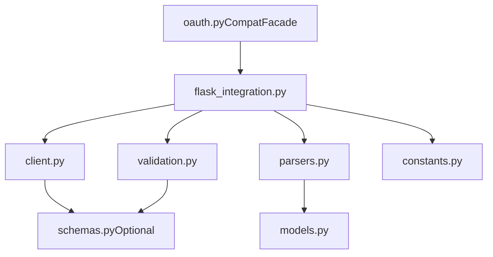

# OAuth Robustness Refactor Plan

## Goals
- Keep existing public usage fully compatible, including `from auth_connect import oauth` and current function signatures/behavior.
- Add optional `pydantic` v2 support: validate outbound/inbound OAuth payloads and serialize app-bound surface API payloads when available.
- Split the monolithic `oauth.py` into cohesive modules with clearer responsibilities, constants, and docstrings.
- Update documentation to explain optional validation mode, new internals, and compatibility guarantees.

## Current Hotspots (to preserve while improving)
- Token exchange currently posts positional second arg (treated as form data by `requests`) and parses JSON manually.
- Surface routes are bound directly in `init_app` and currently redirect with lambda handlers.

```230:247:/home/kelvin/IdeaProjects/auth_connect/oauth.py
def _request_access_token(authorization_token):
    if not authorization_token:
        raise OAuthRequestError('authorization token is required')
    ...
    try:
        response = requests.post(config_server['url'] + config_server['token_api'], params)
```

```486:507:/home/kelvin/IdeaProjects/auth_connect/oauth.py
def init_app(app: Flask, config_file: str = 'oauth.config.json', login_callback=None) -> None:
    ...
    app.add_url_rule(client_config['callback_path'], None, _oauth_callback)
    app.add_url_rule(client_config['profile_path'], 'account_profile',
                     lambda: redirect(server_url + server_config['profile_page']))
```

## Target Module Structure
- Keep `/home/kelvin/IdeaProjects/auth_connect/oauth.py` as a compatibility facade re-exporting public symbols.
- Add package modules under `/home/kelvin/IdeaProjects/auth_connect/auth_connect/`:
  - `[constants.py](/home/kelvin/IdeaProjects/auth_connect/auth_connect/constants.py)`
  - `[exceptions.py](/home/kelvin/IdeaProjects/auth_connect/auth_connect/exceptions.py)`
  - `[models.py](/home/kelvin/IdeaProjects/auth_connect/auth_connect/models.py)`
  - `[schemas.py](/home/kelvin/IdeaProjects/auth_connect/auth_connect/schemas.py)` (optional Pydantic v2 contract models + serializers)
  - `[validation.py](/home/kelvin/IdeaProjects/auth_connect/auth_connect/validation.py)` (runtime import guard + fallback helpers)
  - `[config.py](/home/kelvin/IdeaProjects/auth_connect/auth_connect/config.py)` (config loading + optional validation)
  - `[client.py](/home/kelvin/IdeaProjects/auth_connect/auth_connect/client.py)` (OAuth HTTP calls + error mapping)
  - `[parsers.py](/home/kelvin/IdeaProjects/auth_connect/auth_connect/parsers.py)` (domain parsing for user/group)
  - `[flask_integration.py](/home/kelvin/IdeaProjects/auth_connect/auth_connect/flask_integration.py)` (decorators, callback flow, route binding)
  - `[__init__.py](/home/kelvin/IdeaProjects/auth_connect/auth_connect/__init__.py)` (public exports)

## Optional Pydantic v2 Strategy
- Add optional dependency entry (extra) so base install remains lightweight.
- In `validation.py`, implement guarded import:
  - if pydantic v2 is available: use `BaseModel` models to validate and serialize
  - if unavailable: preserve existing parsing behavior and manual validation
- Validate these contracts when enabled:
  - token request payload (`client_id`, `client_secret`, `redirect_url`, `token`)
  - token response (`access_token`)
  - profile/admin payloads returned from OAuth server
  - app-bound surface payloads for route helpers (e.g., redirect target params and error response JSON schema)
- Use permissive model config (`extra='ignore'`) to avoid breakage from extra server fields.

## Refactor & Compatibility Flow


## Implementation Steps
1. Introduce new package modules (`constants`, `exceptions`, `models`) and move code without behavior change.
2. Extract HTTP and parsing logic into `client.py` + `parsers.py`; centralize shared snippets/constants.
3. Move Flask-specific logic (`requires_login`, `requires_admin`, callback, `init_app`) into `flask_integration.py`.
4. Implement optional Pydantic v2 models and validation gates in `schemas.py`/`validation.py`.
5. Integrate optional serialization for surface APIs bound in `init_app` paths and error payload construction.
6. Replace root `oauth.py` with strict compatibility shim re-exporting public API.
7. Add/adjust tests (or at minimum smoke scripts) for:
   - no-pydantic path (legacy behavior)
   - pydantic-installed path (validation/serialization active)
   - callback + admin flow against `mock_oauth_server.py`.
8. Update README and examples to document optional extra and module architecture.

## README Updates
- Update requirements section with optional extra for pydantic v2.
- Document behavior differences when pydantic is installed (validation errors, stricter contracts).
- Keep quick-start import unchanged; add note that internals are modularized.
- Update file layout section to reflect package split and compatibility shim.
- Add short migration note: existing public API remains supported.

## Risks and Mitigations
- Risk: accidental API drift during module split.
  - Mitigation: compatibility shim + explicit re-export list + regression checks.
- Risk: strict validation rejecting payloads accepted before.
  - Mitigation: optional mode, permissive `extra='ignore'`, focused required-field checks.
- Risk: route binding behavior changes in `init_app`.
  - Mitigation: preserve rule names/paths and add callback/profile/admin route smoke tests.